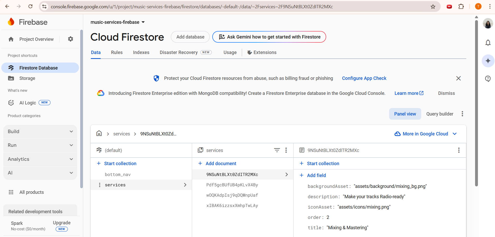

# music_services_module_assignment

## Screen Recording:

Pixel 7 Pro Emulator:
[Android Emulator - Pixel_7_Pro_API_34_Recording.mp4](..%2F..%2FDownloads%2FAndroid%20Emulator%20-%20Pixel_7_Pro_API_34_Recording.mp4)

Pixel 2 Emulator (responsiveness and scrollable ListView):
[Android Emulator - Pixel_2_API_34_Recording.mp4](..%2F..%2FDownloads%2FAndroid%20Emulator%20-%20Pixel_2_API_34_Recording.mp4)

## App Apk :
[app-release.apk](build%2Fapp%2Foutputs%2Fflutter-apk%2Fapp-release.apk)
## Folder structure:
- `music_services_module_assignment/`
  - `assets/`
    - `background/` : for service card background images  
    - `bottomNav/` : for bottom navigation bar icon images
    - `icons/` : for service card icon images

  - `lib/`
    - `models/`: data models like `ServiceModel`, `NavItemModel`.
    - `repositories/`: firestore data fetching logic.
    - `services/`: dependency injection setup using get_it.
    - `view_models/`: State management and business logic.
    - `views/`: Main screen views (`HomeScreen`, `ServiceDetailScreen`).
    - `widgets/`: Reusable UI components (e.g., `ServiceCard`, `CustomBottomNavBar`).
  
  - `firebase_options.dart`: Auto-generated Firebase configuration for all platforms.

  - `main.dart`: App entry point and Firebase initialization.

  - `pubspec.yaml`: Declares dependencies and assets.

## Approach

- **Data Storage:** Service data (title, description, icon asset path, background asset path, order) and bottom navigation items are stored in Firebase Firestore. They are rendered dynamically on execution of application without being hard-coded, thus reducing code base and leading to more scalable solutions

- **Assets:** Images are stored locally in `assets/` and referenced dynamically via Firestore.

- **State Management:** Uses Provider with MVVM architecture; view models fetch from repositories.

- **UI:**
  - Service cards and navigation bar load dynamically from Firestore.
  - Responsive design with `MediaQuery`.
  Test: Pixel 2 API 34 emulator

Pixel 7 Pro API 34 emulator:

  - Custom made bottom navigation bar to incorporate custom logos and semi-circle indicator (for current active page).
  - Stateful HomeScreen widget to navigate across pages from navigation bar.
  - Uses `SafeArea` and `SingleChildScrollView` for proper scrollable layout.

- **Error Handling:** Displays retry on Firestore errors.

- **Build:** Asset registration and dependency injection with GetIt.

  Thank you for reviewing the project!

